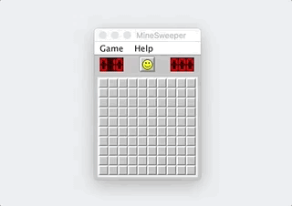
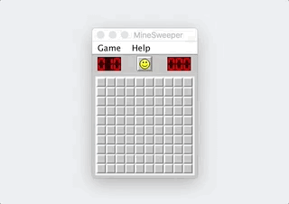

# Minesweeper
> Replica of the classic Microsoft original game written in Java

	
	
	

### About
Minesweeper is game originally developed my Microsoft. The objective of the game is to find the empty squares while avoiding the mines. The faster you clear the board, the better your score. The rules in Minesweeper are simple: Uncover a mine and the game ends, uncover an empty square and you keep playing, uncover a number and it tells you how many mines lay hidden in the eight surrounding squares - information you use to deduce which nearby squares are safe to click. Right click to flag a potential mine or set a question mark. Press the smiley to reset.

### Authors
This project was created by **Rafael Grigorian** and **Marek Rybakiewicz**. It was originally assigned for _Project #02_ for the class _CS342 (Software Design)_ at the _University of Illinois at Chicago_.

### Building & Executing
Maven is used as the build system for this project. In order to build the source files, package them into a jar file, and preform unit testing, run `mvn package`.  In order to skip unit testing, simply run `mvn package -DskipTests`. In order to launch Minesweeper, run `java -cp target/minesweeper-1.0.0.jar com.minesweeper.MineSweeper`.
